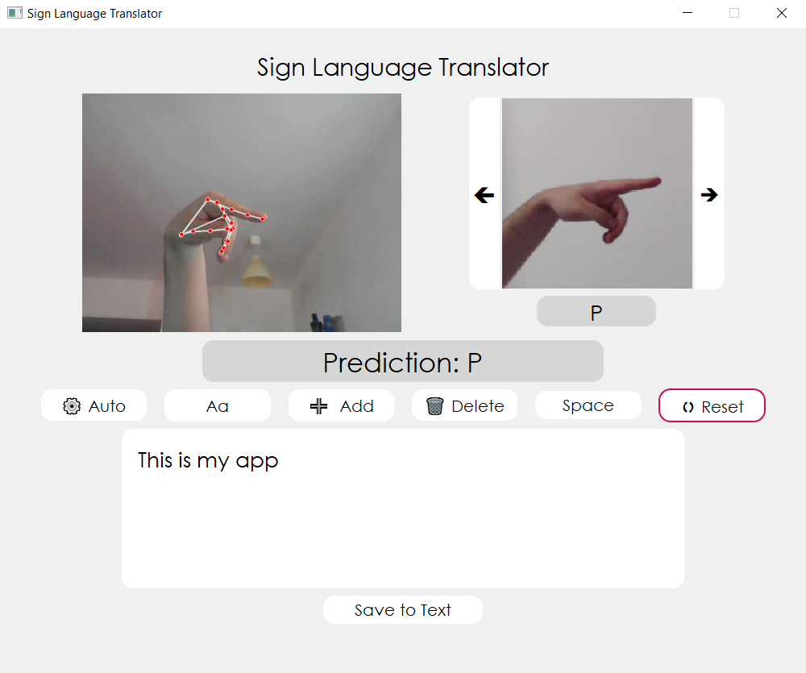

# Sign-Language-Translator-using-MediaPipe-Hands-and-MLPClassifier

A lightweight, **offline** desktop application that recognises static American Sign Language (ASL) letters **(A–Z)**, digits **(0–9)** + **'delete'** and **'space'** gestures from a normal webcam and converts them to text in real‑time.

---

## Necessary libraries

> All packages can be installed in one go with the provided `requirements.txt`, but the table below clarifies what each library actually does.

| Library             | Purpose                                                                  |
| ------------------- | ------------------------------------------------------------------------ |
| **OpenCV**          | Webcam capture, colour conversion, drawing landmarks                     |
| **MediaPipe Hands** | Hand‑tracking: 21 landmarks per frame                                    |
| **NumPy**           | Efficient storage & vector maths (42 features × N samples)               |
| **scikit‑learn**    | `MLPClassifier` (128‑64) for training & inference                        |
| **joblib**          | Serialising the trained model & label map into `sing_language_model.pkl` |
| **PyQt5**           | Desktop GUI, realtime video stream via `QImage`                          |

```bash
# quick start
python -m venv venv
source venv\Scripts\activate # for Windows
pip install -r requirements.txt
```

---

## How it works

1. **Data pre‑processing** (`data_preprocessing.py`)

   - Loops through the `dataset/` folders (A…Z, 0…9, _del_, _nothing_, _space_).
   - For every image: BGR → RGB, feed into MediaPipe; if one hand is found, save the 42‑D vector + the numeric label.
   - Dumps everything to `model/hand_landmarks_dataset.npy` so you never have to rerun this heavy step unless the dataset changes.

2. **Model training** (`train_model.py`)

   - Loads the `.npy`, does an 80/20 train‑test split.
   - Trains a 2‑layer MLP (128‑64, ReLU, 1000 epochs) that reaches ≈ 90 % accuracy on the held‑out set.
   - Persists the classifier and the reverse label map to `sign_language_model.pkl` via `joblib`.

3. **Live application** (`sign_language_translator_app.py`)

   - Opens the webcam with OpenCV, sets buffer‑size = 1 for minimum latency.
   - A `QTimer` ticks every 30 ms (≈ 33 fps):

     - grabs a frame, extracts landmarks, predicts the sign;
     - draws the hand skeleton on the video feed;
     - updates the GUI widgets (current prediction, running transcript).

   - Extra: _Auto‑mode_ that inserts the prediction every second, slideshow help images, one‑click export to `.txt`.

---

##  How to run & use the app

1. Run `sign_language_translator_app.py` and the interface should look like this:
   
2. **Position your hand** inside the frame; the current letter appears under the video.
3. Click **Add** (or enable ⚙️ Auto) to append it to the transcript box.
4. Use **Space**, **Delete** or **Reset** for quick edits; press **Save to Text** to export.

### Licence

MIT – do whatever you want, just leave a star if you find it useful!
